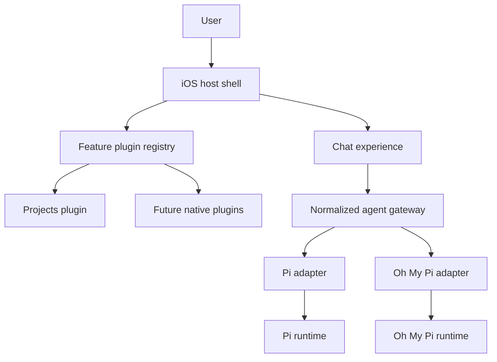

# Personal Agent iOS Plugin Runtime - Requirements

## Summary

An open-source iOS agent client that selects Pi or Oh My Pi per chat and presents app features through a removable native plugin system. The first plugin migration moves Projects out of the core shell while preserving its data and user experience.

---

## Problem Frame

The current iOS client can send messages through a local agent gateway, but its product features and navigation are compiled into one application structure. Projects, settings, server selection, and chat behavior can therefore become coupled as the personalized client grows.

Pi and Oh My Pi also expose related but different headless protocols, commands, events, configuration, and session state. Treating them as one raw runtime would make chat continuity unreliable and would leak runtime-specific behavior into the iOS client.

The public repository needs a clean contribution model. A contributor should be able to add or remove a user-facing feature without editing core route switches throughout the app. The repository must also remain safe to publish: deployment details, credentials, private resource identifiers, and machine-specific configuration do not belong in tracked source.

---

## Key Decisions

- **Select a runtime per chat.** Every chat is pinned to Pi or Oh My Pi. This keeps runtime-specific hidden state coherent and makes the active agent implementation visible.
- **Fork instead of live-migrating.** Changing the runtime on an existing conversation creates a new chat and hydrates the fresh runtime exactly once from the ordered user-visible transcript. Hidden reasoning, tool state, and native session data do not transfer.
- **Normalize at the gateway.** The iOS client uses one product-level conversation contract. Separate gateway adapters translate Pi and Oh My Pi commands and events.
- **Use native plugins first.** Initial plugins are Swift modules compiled and signed with the app. The host contract remains independent of any one feature so a restricted script adapter can be considered later.
- **Preserve plugin data when disabled.** Disabling a plugin removes its contributions and cancels work registered with the host, but data written through the host's namespaced storage remains available if the plugin is enabled again.
- **Distribute source through GitHub under MIT.** The first public release contains source only. Users build and sign device apps locally; binary release artifacts, App Store distribution, and custom signing automation are not initial requirements.
- **Keep the product single-user and credential-free.** The app does not include account registration, Clerk, sign-in, sign-out, or user credential flows.
- **Leave network exposure to the operator.** The app adds no account or gateway credential flow. The gateway keeps a loopback default; any non-loopback binding and network protection are deployment choices outside the client.

---

## Actors

- A1. **User:** Runs a personal iOS client, chooses the runtime for each chat, and controls installed feature availability.
- A2. **iOS host shell:** Owns global navigation, shared presentation, chat selection, settings, and plugin composition.
- A3. **Feature plugin:** Declares identity and contributions, owns its feature state and internal navigation, and participates in a bounded lifecycle.
- A4. **Agent gateway:** Exposes the normalized conversation contract used by the app.
- A5. **Runtime adapter:** Translates the normalized contract to one supported runtime without leaking its protocol into the client.
- A6. **Agent runtime:** Pi or Oh My Pi, with its own session, tools, events, and configuration.
- A7. **Contributor:** Adds or removes a native feature through the plugin contract and builds a signed app.

---

## Requirements

**Runtime selection and chat continuity**

- R1. A new chat must let the user select Pi or Oh My Pi before the first message.
- R2. Every chat must store exactly one runtime identity and show that identity in the chat interface.
- R3. Messages in a chat must continue through its pinned runtime unless the user explicitly requests a runtime change.
- R4. Changing the runtime for an existing chat must create a new chat, hydrate its fresh runtime session exactly once from the complete ordered user-visible transcript, and continue new turns from that visible context.
- R5. A runtime change must leave the original chat and its runtime session unchanged.
- R6. The runtime fork must transfer user and assistant content that the user could see, but must not transfer or claim to transfer hidden reasoning, tool execution state, queued work, or runtime-native session metadata.
- R7. If a selected runtime is unavailable or misconfigured, the app must show that runtime as unavailable and must not silently send the chat through another runtime.

**Gateway and runtime adapters**

- R8. The iOS client must use one normalized contract for chat creation, transcript hydration, message submission, streaming updates, cancellation, runtime status, and error reporting.
- R9. Pi and Oh My Pi must each have a separate adapter that owns its executable, launch flags, protocol negotiation, command mapping, event mapping, and session lifecycle.
- R10. Runtime-specific events that have no normalized equivalent must remain identifiable without breaking common text, thinking, tool, completion, cancellation, and error events.
- R11. The app and gateway must durably preserve each chat's runtime identity and logical session key, then restore the correct adapter and native session after reconnect or process restart.
- R12. A failure in one runtime adapter must not make chats assigned to the other runtime unavailable.

**Native plugin host**

- R13. The host must discover compiled feature plugins through one registry rather than through feature-specific branches spread across the app.
- R14. Every plugin must declare a stable identifier, user-facing metadata, compatibility information, lifecycle behavior, and typed contribution points.
- R15. The host must support plugin contributions for navigation entries, feature views, commands, and settings without requiring the core shell to know the plugin's concrete feature type.
- R16. The user must be able to enable or disable each optional plugin at runtime.
- R17. Disabling a plugin must remove its visible contributions, cancel work that the plugin registered with the host, and prevent activation on the next launch.
- R18. Disabling a plugin must preserve its namespaced data by default.
- R19. Re-enabling a compatible plugin must restore access to its preserved data.
- R20. Storage accessed through the plugin host must use stable plugin namespaces so host-mediated writes cannot collide by plugin identity.
- R21. A plugin compatibility check or recoverable activation error must report its failure without preventing the host shell, chat, or unrelated plugins from starting.
- R22. The host's plugin representation must not require every future plugin implementation to use the same execution language, even though the first version contains only compiled Swift plugins.

**Projects as the first plugin**

- R23. Projects must move from a core application feature to a first-party plugin registered through the same public contract available to future native plugins.
- R24. The Projects plugin must own its project list, project detail, project-specific commands, settings, and internal navigation.
- R25. Enabling Projects must add all of its intended navigation and command contributions.
- R26. Disabling Projects must remove those contributions without deleting projects, project metadata, or chat associations.
- R27. Re-enabling Projects must restore the existing project data and chat associations.
- R28. Removing the Projects plugin from a build must not require feature-specific edits throughout the host shell.

**Public repository and configuration**

- R29. The repository must include the MIT license and identify the licenses of included third-party code.
- R30. GitHub releases must publish tagged source only; the project must not promise a directly installable device binary.
- R31. Native plugins must be compiled and signed as part of each user's local application build; installing a new native plugin requires a new build.
- R32. Tracked source, documentation, examples, tests, commit metadata, and release metadata must not contain private hostnames, organization identifiers, personal credentials, deployed resource identifiers, or private planning references.
- R33. Machine-specific server addresses, signing values, and secrets must come from ignored local configuration or user-entered settings.
- R34. Public examples must use neutral names and non-routable placeholder values.
- R35. A fresh contributor checkout must explain how to configure a local gateway, build and sign the app locally, add a compiled plugin, and verify its contributions without access to the original developer's environment.

**Credential-free personal use**

- R36. The iOS application must not include Clerk packages, account screens, authentication gates, sign-out actions, associated web credentials, or account-derived identity.
- R37. The app must boot directly into the local personal experience.
- R38. Gateway binding, remote access, and network protection are deployment responsibilities; the client must not add credentials unless a later product decision explicitly adds them.

---

## Key Flows

- F1. Start a Pi chat
  - **Trigger:** A1 creates a chat and selects Pi.
  - **Actors:** A1, A2, A4, A5, A6
  - **Steps:** The host creates a chat pinned to Pi; the gateway selects the Pi adapter; the adapter creates a Pi session; streamed normalized events return to the chat.
  - **Outcome:** The chat visibly remains a Pi chat for its lifetime.
  - **Covered by:** R1-R3, R8-R11
- F2. Start an Oh My Pi chat
  - **Trigger:** A1 creates a chat and selects Oh My Pi.
  - **Actors:** A1, A2, A4, A5, A6
  - **Steps:** The host creates a chat pinned to Oh My Pi; the gateway selects the Oh My Pi adapter; the adapter creates an Oh My Pi session; streamed normalized events return to the chat.
  - **Outcome:** The chat visibly remains an Oh My Pi chat for its lifetime.
  - **Covered by:** R1-R3, R8-R11
- F3. Change the runtime for an existing conversation
  - **Trigger:** A1 requests a different runtime from an existing chat.
  - **Actors:** A1, A2, A4
  - **Steps:** The app explains that the change creates a new chat; on confirmation, it copies the complete ordered user-visible transcript, creates a fresh runtime session, hydrates that session exactly once, and then accepts the next user turn.
  - **Outcome:** The new chat continues from visible context while the original chat remains unchanged.
  - **Covered by:** R4-R7
- F4. Disable and restore a feature plugin
  - **Trigger:** A1 disables an enabled plugin and later enables it again.
  - **Actors:** A1, A2, A3
  - **Steps:** The host removes the plugin's contributions, cancels host-registered work, and retains host-namespaced data; enabling it later runs compatibility checks, activates it, and restores its contributions.
  - **Outcome:** Feature availability changes without data loss or a host restart.
  - **Covered by:** R16-R21
- F5. Add a native plugin
  - **Trigger:** A7 adds a compiled plugin to a source build.
  - **Actors:** A2, A3, A7
  - **Steps:** The contributor implements the public contract, registers the plugin, builds the app, and verifies its declared contributions and lifecycle.
  - **Outcome:** The new feature appears without adding feature-specific navigation branches to the host shell.
  - **Covered by:** R13-R15, R22, R28, R31, R35

---

## Acceptance Examples

- AE1. **Covers R1-R3.** Given a new chat is configured for Pi, when the user sends messages, then all messages use the Pi adapter and the chat shows Pi as its runtime.
- AE2. **Covers R1-R3.** Given a new chat is configured for Oh My Pi, when the user sends messages, then all messages use the Oh My Pi adapter and the chat shows Oh My Pi as its runtime.
- AE3. **Covers R4-R6.** Given a Pi chat contains an earlier visible fact and tool activity, when the user changes it to Oh My Pi and asks a follow-up about that fact, then the separate Oh My Pi chat answers from the transferred visible transcript while no hidden Pi state is claimed or reused.
- AE4. **Covers R7.** Given Oh My Pi is not configured, when the user attempts to select it, then the app shows it as unavailable and does not fall back to Pi.
- AE5. **Covers R12.** Given the Pi adapter fails to start, when an existing Oh My Pi chat reconnects, then that chat remains usable.
- AE6. **Covers R16-R19, R25-R27.** Given Projects contains saved projects and chat associations, when the user disables and then re-enables Projects, then its navigation disappears and returns with the original data intact.
- AE7. **Covers R17.** Given a plugin was disabled before the app closed, when the app starts again, then that plugin does not activate or contribute UI.
- AE8. **Covers R21.** Given one optional plugin fails compatibility checks or returns a recoverable activation error, when the app starts, then chat and compatible plugins remain available and the failed plugin reports an actionable state.
- AE9. **Covers R13-R15, R28.** Given a contributor adds a new native feature plugin, when the plugin is registered, then its declared navigation, commands, and settings appear without a feature-specific route case in the host shell.
- AE10. **Covers R32-R35.** Given a fresh public checkout, when publication and setup checks run, then tracked content contains only neutral configuration examples and the contributor can configure a local gateway without private environment data.
- AE11. **Covers R36-R37.** Given the app launches after installation, when initialization completes, then the personal chat experience appears without an account or sign-in flow.

---

## Success Criteria

- Pi and Oh My Pi can each complete a real streamed chat through the same iOS conversation experience.
- Runtime identity remains stable and visible for every chat, including after reconnect and app restart.
- A user can disable and re-enable Projects without losing project or chat-association data.
- A contributor can add a small native plugin without editing core feature routing.
- Removing Projects from a build leaves a working chat application.
- The source-only public repository builds from neutral documented configuration and passes the private-identifier safety gate.

---

## Scope Boundaries

### Deferred for later

- Downloadable or interpreted script plugins.
- A hosted plugin marketplace, dependency resolver, remote update channel, and plugin trust marketplace.
- Automated per-user IPA compilation, certificate management, provisioning, and signing.
- Prebuilt device binaries and directly installable signed IPAs.
- App Store submission and review-policy work.
- Migration of hidden session state between Pi and Oh My Pi.
- Live mutation of one chat's runtime in place.
- Third-party native plugin sandboxing beyond the boundaries available to code compiled into the same iOS process.

### Outside this product's identity

- Multi-user accounts, organization membership, Clerk, and client-side credential management.
- A server administration console or model-host management product.
- Treating Pi and Oh My Pi as app feature plugins; they are agent runtimes behind gateway adapters.

---

## Dependencies / Assumptions

- iOS requires executable application code to be compiled and signed before it runs on a device.
- Pi and Oh My Pi both provide headless RPC operation, but their protocol and lifecycle differences require separate adapters.
- The gateway can launch and supervise both runtime executables near the user's model service.
- GitHub is the tagged source distribution channel for the first public version.
- Native plugins are trusted code compiled into the app and share the app process; host-mediated lifecycle and storage boundaries are not a security sandbox.
- The product remains single-user and does not require an application account; gateway network exposure is the deployment operator's responsibility.

---

## Outstanding Questions

### Resolve before planning

- None.

### Deferred to planning

- The normalized gateway event and command schema.
- The Swift packaging boundary for the host contract and first-party plugins.
- The placement of runtime selection and plugin controls within the existing visual design.
- The storage mechanism used to enforce plugin namespaces and preserve disabled-plugin data.
- The local device build and signing instructions.

---

## Sources / Research

- [Pi coding agent](https://github.com/badlogic/pi-mono) - headless runtime, RPC, tools, sessions, and extension model.
- [Oh My Pi coding agent](https://github.com/can1357/oh-my-pi) - related runtime with its own commands, events, extensions, and configuration.
- [Apple platform code signing](https://support.apple.com/guide/security/app-code-signing-process-sec7c917bf14/web) - mandatory signing constraints for iOS executable code.
- [Swift Package Manager](https://docs.swift.org/swiftpm/documentation/packagemanagerdocs/) - native Swift package and modular build model.
- [Visual Studio Code extension manifest](https://code.visualstudio.com/api/references/extension-manifest) and [contribution points](https://code.visualstudio.com/api/references/contribution-points) - stable plugin identity, compatibility, activation, and declared host contributions.
- [Backstage frontend extensions](https://backstage.io/docs/frontend-system/architecture/extensions/) - typed extension inputs, outputs, attachment points, and host composition.
- [Obsidian plugin anatomy](https://docs.obsidian.md/Plugins/Getting+started/Anatomy+of+a+plugin) - manifest, lifecycle, component cleanup, and separately stored plugin data.
